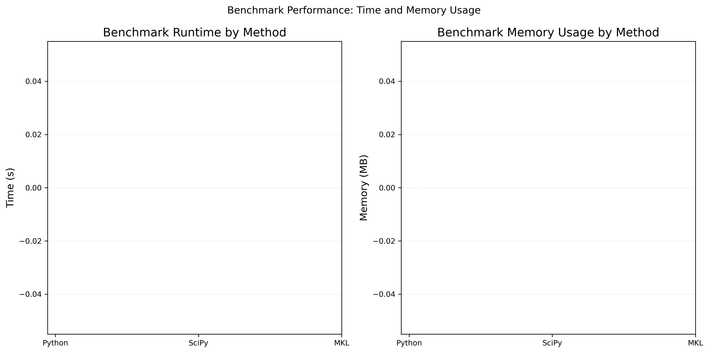

# Integral Tool

This repository contains a simple Python implementation of a Huygens–Fresnel integral
for hologram computation. It includes a GitHub Actions workflow that runs a demo
and can be used for benchmarking.

## Usage

```bash
pip install -r requirements.txt
python main.py
```

The script generates random point sources, computes the field on a plane, and
outputs the amplitude and phase information.

## Benchmark Results

The following table is automatically updated by the GitHub Actions workflow.

<!-- BENCHMARK_START -->
| Date | Machine | Python | Git | Python(s) | SciPy(s) | MKL(s) | Amp shape | Phase shape |
|------|---------|--------|-----|----------|---------|-------|-----------|-------------|

| 2025-06-21T14:32:53.330929Z | Linux-6.11.0-1015-azure-x86_64-with-glibc2.39 | 3.13.5 | 8cbfb0e | 0.016 | 0.057 | 0.009 | 64x64 | 64x64 |
<!-- BENCHMARK_END -->

Below is a plot of benchmark runtimes:


